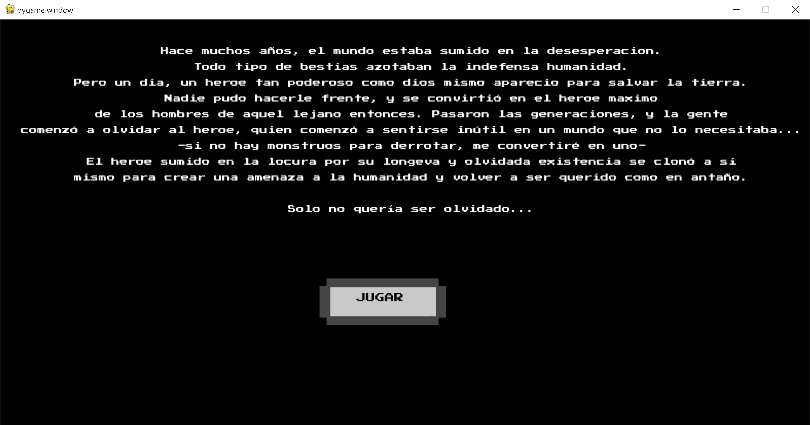
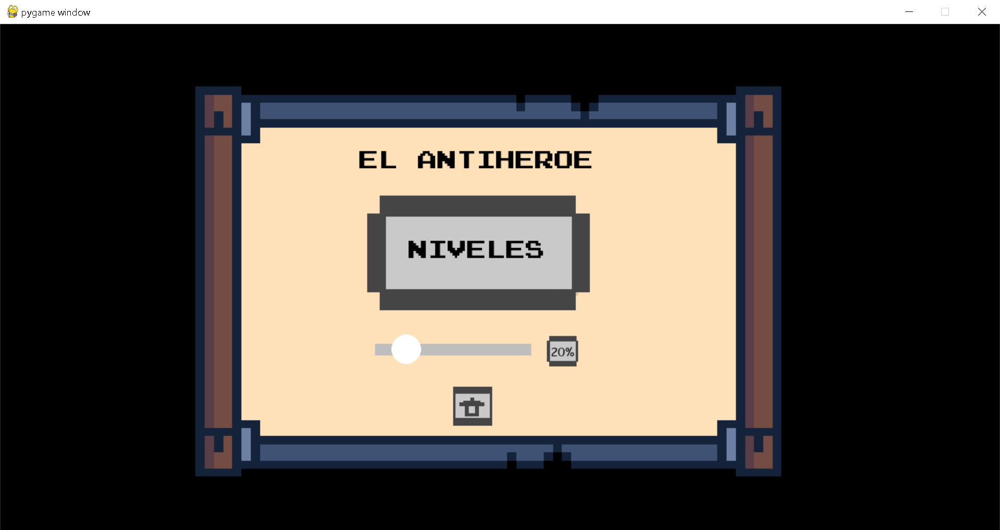
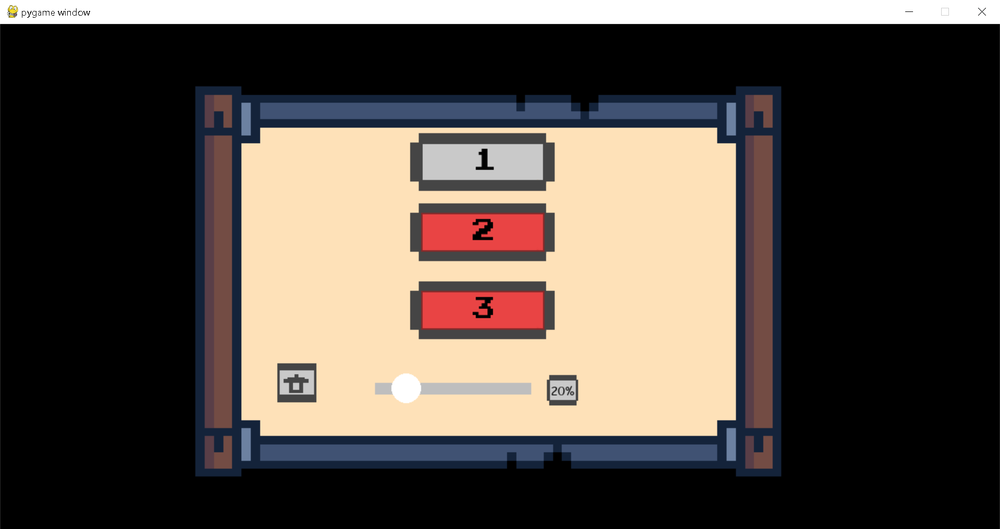
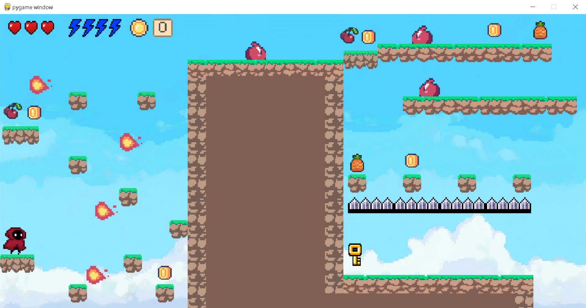
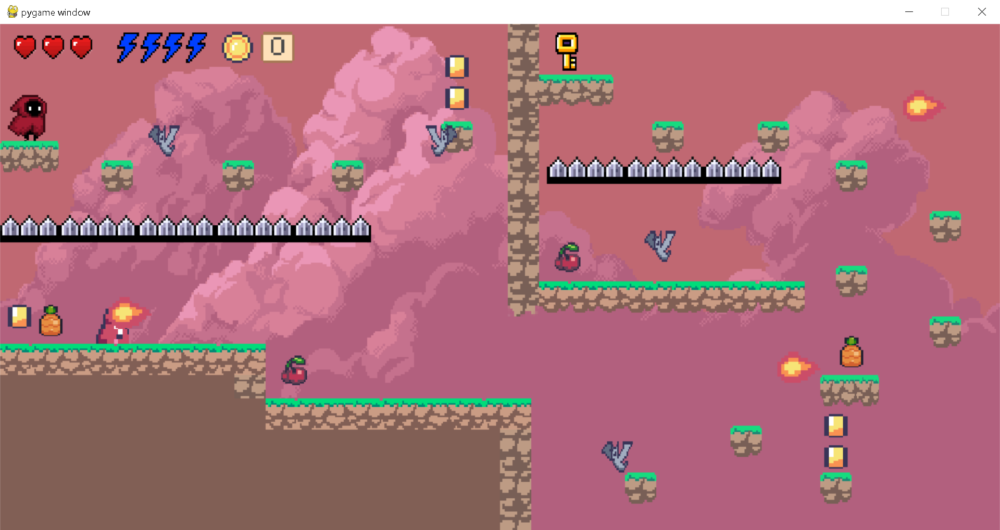
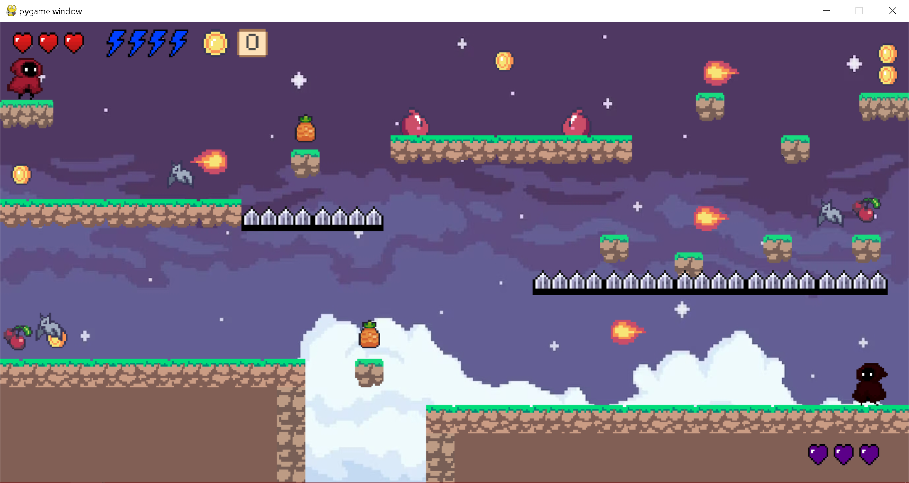

# JUEGO PLATAFORMERO HECHO CON PYTHON

### Utilizando python, realizé un básico juego plataformero con 3 niveles jugable para cualquiera. 

## Historia:
El juego cuenta con historia propia la cual el juego mismo te irá planteando

## Pantallas:
En el juego podrás pausar en cualquier momento, salir al menu principal, ir al menu selector de niveles... en definitiva, hacer una navegación completa entre pantallas

# Juego:
El juego cuenta con gráficos retro; animaciones fluidas y estéticas; objetos consumibles como monedas u otros que dan ventajas dentro del juego, así como con enemigos a derrotar 

#### ¡¡Disfruten el juego!!

## EJECUTABLE -> 

### Imagenes del juego:

#### Niveles: 

